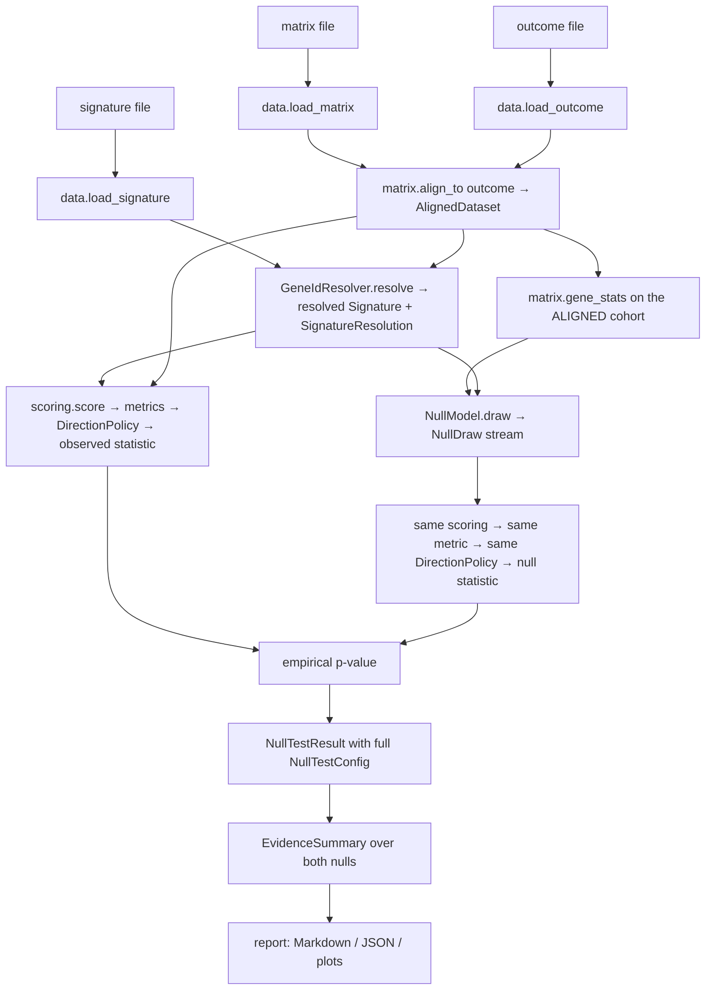

# signull — architecture and contracts

Status: **binding for wave 2.** Everything in this document is a contract between
packages, not a suggestion. The machine-readable half lives in
[`src/signull/types.py`](../src/signull/types.py) (contract version `1.0.0`); this
document explains the parts a type annotation cannot carry.

---

## 1. What the tool computes

Given a candidate gene signature, a cohort expression matrix and a **binary** patient
outcome, `signull` answers one question with a number that can be defended:

> Is this signature more predictive of this endpoint, in this dataset, under this
> scoring method, than size-matched signatures drawn from the same dataset?

It produces an empirical p-value against **two different nulls** and an evidence
summary that carries the full configuration used to obtain it.

Two nulls, two questions — they are not interchangeable and neither substitutes for
the other:

| Null | `NullType` | Question | What varies | What is held fixed |
|---|---|---|---|---|
| Random gene-set | `RANDOM_GENE_SET` | Is *this gene set* special among gene sets? | the gene set (size-matched, optionally property-matched) | the labels |
| Label permutation | `LABEL_PERMUTATION` | Is there *any* outcome signal here at all? | the labels | the gene set |

**Mapping onto the null labels in [`docs/statistical-design.md`](statistical-design.md)** —
that document names four nulls; the contract expresses all four without a new enum
member, because *matching* is a property of the sampler, not a different null:

| Design label | Contract expression |
|---|---|
| `N0` uniform random gene sets | `NullSpec(RANDOM_GENE_SET, matching=MatchingSpec())` — empty `properties` |
| `N1` property-matched random gene sets (default) | `NullSpec(RANDOM_GENE_SET, matching=MatchingSpec(properties=(MEAN_EXPRESSION, VARIANCE, DETECTION_RATE)))` |
| `N2` label permutation | `NullSpec(LABEL_PERMUTATION)` |
| `N3` coherence-matched sets (reported, not gating) | `N1` plus `MatchingSpec.set_level_constraints={"mean_abs_correlation": 0.02}` — set-level, so rejection-sampled, not binned |

Adjusted arms (e.g. dominant-axis-residualised scores) are additional
`NullTestResult`s over the same nulls, distinguished by `ScoringSpec.params` and
`NullTestResult.label`; use `EvidenceSummary.results_for(null_type)` rather than
assuming one result per null.

A signature can pass the permutation null (real signal) and fail the gene-set null
(any 200 random genes would have done as well). That combination is the single most
important thing this tool exists to detect, so both results are always reported side
by side.

---

## 2. Module boundaries and ownership map

One package owns each concept. **Do not create a file outside your column** — if you
need something that lives in someone else's package, it goes through the contract in
`types.py`.

| Package | Owns (create these) | Implements from `types.py` | Must NOT contain |
|---|---|---|---|
| `signull/types.py` | the contracts | — | any analysis logic |
| `signull/data/` | matrix loaders (TSV / CSV / HDF5 / AnnData), signature I/O (GMT, CSV, JSON), outcome loading, identifier resolution + annotation tables, sample alignment, per-gene statistics, gene filtering / eligible-universe construction | `ExpressionMatrix`, `GeneIdResolver`, and constructors for `Signature`, `BinaryOutcome`, `AlignedDataset`, `GeneStats`, `DatasetDescriptor`, `Provenance` | scoring, metrics, sampling, p-values |
| `signull/nulls/` | random gene-set samplers (size-only and property-matched, incl. the quantile-binning matcher), label-permutation sampler, the empirical p-value estimator function | `NullModel`, produces `NullDraw` | scoring, metrics, the evaluation loop, I/O |
| `signull/scoring/` | signature scoring strategies + a name→strategy registry | `ScoringMethod`, produces `SampleScores` | metrics, sampling, I/O, anything that reads the outcome outside a CV fold |
| `signull/metrics/` | AUROC, average precision, chance levels, application of `DirectionPolicy` | `Metric` | scoring, sampling, I/O |
| `signull/report/` | rendering `EvidenceSummary` → Markdown / JSON / plots, JSON (de)serialisation of `NullTestConfig` and `NullTestResult` | — | any recomputation of statistics |
| `signull/pipeline.py`, `signull/cli.py` | **wave 3 only** — the orchestration loop, `run_null_test`, `run_evidence_summary`, CLI | assembles `NullTestConfig`, `NullTestResult`, `EvidenceSummary` | new statistics |

**Import direction (enforced by review):**

```
types.py        →  imports nothing from signull
data/           →  types
nulls/          →  types            (NOT scoring, NOT metrics)
scoring/        →  types            (NOT nulls, NOT metrics)
metrics/        →  types            (NOT scoring, NOT nulls)
report/         →  types
pipeline/cli    →  types, data, nulls, scoring, metrics, report
```

`nulls/` deliberately does not know how signatures are scored, and `scoring/` does not
know that nulls exist. The evaluation loop that joins them is wave-3 property. This is
what makes "the scoring method is applied identically to candidate and nulls"
structurally true rather than a convention someone has to remember.

**Registries.** `scoring/`, `nulls/` and `metrics/` each expose a `REGISTRY:
dict[Enum, Callable[..., Strategy]]` keyed by the corresponding enum
(`ScoringMethodName`, `NullType`, `MetricName`) plus a `get(name, **params)` factory.
The CLI resolves strings to strategies only through these registries, so a new
strategy is one entry, not a new branch in the pipeline.

**Tests.** `tests/test_data.py`, `tests/test_nulls.py`, `tests/test_scoring.py`,
`tests/test_calibration.py` — one file per campaign; do not edit another campaign's
test file.

---

## 3. End-to-end call flow



Step by step, with the invariants each step establishes:

1. **Load.** `data/` reads the matrix (**genes × samples**, log-like normalised units),
   the outcome and the signature, attaching a `Provenance` with a checksum to each.
2. **Align.** `matrix.align_to(outcome)` intersects sample identifiers and returns an
   `AlignedDataset` with `matrix.sample_ids == outcome.sample_ids`. Everything after
   this point sees exactly one sample set, so candidate and nulls are provably scored
   on the same patients.
3. **Gene statistics.** Computed *after* alignment, on the analysis cohort only.
   Matching a null against statistics from a larger raw cohort silently misspecifies
   the null.
4. **Resolve.** `GeneIdResolver.resolve` maps the signature onto the matrix index and
   returns `(resolved_signature, SignatureResolution)`. The **effective size**
   (`resolution.n_matched`) — never the nominal size — is what nulls are matched to.
5. **Eligible universe.** `NullModel.eligible_universe(dataset)` = the matrix index
   after the run's filters. Dataset-specific by construction: the share of random
   signatures that reach significance ranges from ~1 % to ~40 % across datasets, so a
   universe borrowed from another dataset makes the p-value meaningless.
6. **Observed statistic.** `scoring.score(dataset, resolved_signature, rng)` →
   `metric(scores, outcome)` → `DirectionPolicy` applied.
7. **Null statistics.** For every `NullDraw`, the *identical* call chain on
   `(draw.signature, draw.outcome)`. Same strategy instance, same metric, same
   direction policy, same CV folds where applicable. Because a `NullDraw` always
   carries both a signature and an outcome, one code path serves both nulls.
8. **p-value.** `(1 + #{null at least as extreme as observed}) / (n_valid_draws + 1)`,
   tail per `Alternative`. The add-one is mandatory: an uncorrected zero claims
   infinite evidence from a finite number of draws. Attainable floor is
   `1 / (n_draws + 1)`; report `at_resolution_floor` rather than "p < 0.001" from 100
   draws.
9. **Result.** `NullTestResult` embeds the complete `NullTestConfig` and the
   `SignatureResolution`. A result without its config must never be constructed.
10. **Summary and report.** `EvidenceSummary` collects one result per null. It has no
    verdict field, by design (see §8).

**Statistical conventions already settled — do not re-litigate in wave 2:**

- Nulls match on size **unconditionally**; matching on mean expression, detection rate
  and variance is configurable via `MatchingSpec` and is the recommended default for
  the gene-set null. An unmatched null is biased in the direction that flatters the
  candidate.
- The candidate's own genes stay in the sampling universe by default
  (`exclude_candidate_genes=False`), matching the published random-signature
  benchmarks.
- Unsigned gene sets have arbitrary score direction, so `DirectionPolicy.SYMMETRIZED`
  is the default: fold the metric about its chance level and apply that to candidate
  and nulls alike. `AS_GIVEN` is valid only for a pre-specified signed signature whose
  nulls inherit the same signed structure (reuse the candidate's weight multiset).
- Supervised scoring returns **out-of-fold predictions only**, with feature selection
  inside the folds, and must repeat the full CV for every null draw.
- Reporting the proliferation/dominant-axis confound is a wave-3 report concern; the
  hook is `ScoringSpec.params` (e.g. an adjustment covariate), not a new statistic.

---

## 4. Gene identifier policy

Identifier mismatch is the dominant silent failure mode for this class of tool: a
namespace mismatch turns a 200-gene signature into a 7-gene one and every downstream
number stays superficially plausible. The policy is therefore strict.

**Canonical namespace: HGNC-approved gene symbol** — uppercase, unversioned
(`GeneIdNamespace.HGNC_SYMBOL`). Chosen over Ensembl IDs because published signatures
and the benchmark microarray cohorts are symbol-based, so symbol is the namespace with
the fewest conversions on the common path. Ensembl / Entrez / probe IDs are first-class
*inputs*, never internal representations.

**Conversion happens exactly once**, inside `data/`, at load time, for both the matrix
and the signature. No other package converts, uppercases, strips versions or guesses.
By the time an object crosses a package boundary its `namespace` field is the truth.

Rules:

1. **Version suffixes** are stripped from Ensembl IDs (`ENSG00000141510.14` →
   `ENSG00000141510`) before mapping; the strip is recorded in `SignatureResolution.aliased`.
2. **Aliases and withdrawn symbols** are resolved through a pinned annotation table
   whose identity and version go into `ResolutionSpec.mapping_source` and are echoed in
   `SignatureResolution.mapping_source`. An unpinned mapping makes a result
   irreproducible; a run without one emits a `WARNING` diagnostic.
3. **Ambiguous mappings** (one source ID → several symbols) are dropped, never guessed,
   and land in `SignatureResolution.unmapped`.
4. **Duplicate rows** (several probes → one symbol) are collapsed per
   `DuplicateHandling`, default `MAX_VARIANCE`. Every collapse is enumerated in
   `SignatureResolution.collapsed`. The rule changes results, so it is part of the
   captured config.
5. **Case** is normalised to upper for symbol comparison when
   `ResolutionSpec.case_insensitive` (default). Note the ~40 human symbols that
   collide with Excel dates (`SEPT7`, `MARCH1`) — if a loaded signature contains
   date-like strings, emit `signature_looks_excel_mangled` at `WARNING`.
6. **Missing vs unmapped are tracked separately** because the remedy differs: *missing*
   means the gene is not measured on this platform (a dataset limitation);
   *unmapped* means the identifier could not be translated at all (an annotation bug).
7. **Nothing is dropped silently.** Every requested identifier ends up in exactly one
   of `matched`, `missing` or `unmapped`, and the resolution object is embedded in the
   result and rendered by the report **even when the overlap is perfect**.
8. **Floors abort the run.** Below `ResolutionSpec.min_overlap_fraction` (default
   **0.70**, per `docs/statistical-design.md` F5) or `min_matched_genes` (default 3),
   the run raises regardless of `MissingGenePolicy`. Continuing here is how a namespace
   bug becomes a published p-value. Between the floor and 1.0 the run proceeds on the
   observed subset and nulls are sized to `resolution.n_matched`; both numbers are
   reported.
9. **Nulls are drawn in the canonical namespace** from the matrix index, so they are
   never subject to any of the above — one more reason to compare against the
   *effective* candidate size.

---

## 5. Error taxonomy

Three tiers. Choosing the wrong tier is a review-blocking defect.

### Tier 1 — raise (contract violations and uninterpretable results)

Fail fast, with the offending values in the message. Never downgrade one of these to a
warning to keep a batch run alive.

| Condition | Exception |
|---|---|
| Matrix not genes × samples, or shape disagrees with the index | `ValueError` |
| Non-finite or non-numeric expression values | `ValueError` |
| Duplicate gene or sample identifiers surviving resolution | `ValueError` |
| Matrix/outcome sample intersection empty | `ValueError` |
| Score/outcome sample orders differ at a metric call | `ValueError` (never reorder silently) |
| Degenerate outcome — one class empty after alignment | `ValueError` |
| Overlap below `min_overlap_fraction` / `min_matched_genes` | `ValueError` |
| Missing genes under `MissingGenePolicy.RAISE` | `KeyError` |
| Signature resolves to zero genes | `ValueError` |
| Unknown gene reaching `subset_genes` | `KeyError` (programming error — resolve first) |
| `n_draws < 1`; supervised scoring with `cv=None` | `ValueError` |
| Matching constraint unsatisfiable after widening | `RuntimeError` |
| Unknown strategy name in a registry | `KeyError` |

### Tier 2 — `warnings.warn` **and** a recorded `Diagnostic`

Every warning is *also* a `Diagnostic` on the result: console output does not survive
into a stored result, and an audit must be possible from the JSON alone. Suggested
stable codes:

`low_signature_overlap` · `samples_dropped_in_alignment` · `outcome_missing_dropped` ·
`extreme_class_imbalance` · `small_cohort` · `few_draws_for_claimed_precision` ·
`unmatched_null_requested` · `sparse_matching_bin_widened` · `duplicate_probes_collapsed` ·
`unpinned_annotation_source` · `signature_looks_excel_mangled` · `many_tied_scores` ·
`zero_variance_genes_in_signature` · `permuted_labels_in_use`

### Tier 3 — recorded only, no warning

Normal operating detail that the report must still show: the full
`SignatureResolution`, per-draw diagnostics, `n_draws_requested` vs `n_valid_draws`,
`p_value_floor` / `at_resolution_floor`, `elapsed_seconds`, alias and collapse maps.

**Never**: `except: pass`; substituting `NaN` for a failed metric without recording an
invalid draw; retrying a failed draw silently (it changes the null distribution);
mutating a caller's array or `DataFrame` in place.

---

## 6. Reproducibility policy

**Seeding.** One integer, `NullTestConfig.seed`, is the root of all randomness. Derive
per-component streams with `numpy.random.SeedSequence` spawning — never a global
`np.random.*` call, never a per-call `default_rng()`:

```python
root = np.random.SeedSequence(config.seed)
gene_ss, perm_ss, cv_ss, score_ss = root.spawn(4)
```

Spawn order is fixed by this document: `0` gene-set sampling, `1` label permutation,
`2` CV folds, `3` stochastic scoring. Draw `i` must be reproducible without replaying
draws `0..i-1` where the sampler allows it, and consuming the same iterator twice with
the same seed must yield identical draws.

**Config capture.** Every `NullTestResult` embeds a complete `NullTestConfig`. If a
knob changes the number, it lives in the config — no exceptions, no reading
environment variables inside a strategy. Configs carry `contract_version`,
`signull_version`, `code_revision` (git SHA, `-dirty` suffix when the tree is dirty)
and `created_at`.

**Input identity.** `Provenance.checksum` (sha256 of the raw bytes) is recorded for
matrix, outcome and signature, so a rerun that silently picked up a different file is
detectable.

**Determinism requirements.** Same seed + same inputs + same config ⇒ bitwise-identical
`null_statistics`. Iteration over sets and dicts must never affect output ordering
(sort before sampling). Parallel execution, if added, must partition the seed sequence,
not the RNG stream.

**Versioning of results.** `NullTestResult.result_version` starts equal to
`CONTRACT_VERSION`. Bump `CONTRACT_VERSION` MAJOR when a field is removed or changes
meaning, MINOR when a field is added; `report/` refuses to load a stored result whose
MAJOR exceeds its own.

**Mutability.** Value objects are frozen. Their `Mapping` fields (`params`, `context`,
`tolerance`) are to be treated as read-only — build them once and never mutate;
`MappingProxyType` is welcome.

**Calibration acceptance test** (`tests/test_calibration.py`, wave 3): run the whole
pipeline on permuted labels many times; the resulting p-values must be approximately
uniform (KS test against `U(0,1)`, plus a check that the empirical Type-I error at
α = 0.05 is within Monte-Carlo tolerance of 0.05). Non-uniform p-values mean the tool
is broken, and no other result from it is trustworthy. The API makes this cheap by
construction: permuting labels is `BinaryOutcome(..., is_permuted=True,
permutation_seed=…)` and everything downstream is unchanged.

---

## 7. Interpretation the report must always carry

- Which null produced each p-value, and the question that null answers.
- The scoring method and metric — results are known to be method-dependent.
- Effective signature size vs nominal, plus the resolution table.
- Whether the null was property-matched or size-only.
- The null's mean and spread on the metric scale, not just the p-value; and the
  `p_value_floor` when the estimate is pinned there.
- Cohort size, class balance, and the metric's chance level.

## 8. What this tool must never claim

It computes one narrow thing. These are the claims the code, the CLI text and the
generated report are forbidden to make:

1. **Not "the signature works."** A small p-value says the signature beat *these*
   random signatures on *this* cohort under *this* scoring method and *this* metric.
   It is not clinical validation, not independent replication, not evidence of utility.
2. **Not causal.** Nothing here supports a claim that the genes drive the outcome, are
   drug targets, or explain a mechanism.
3. **Not "the signature is useless"** when p is large. Failure to beat the null is not
   evidence of no effect; it may reflect a small cohort, a mismatched scoring method,
   low overlap, or a genuinely hard endpoint. Report it as "not distinguishable from
   size-matched random signatures in this dataset", never as a negative result about
   the biology.
4. **Not transferable across datasets.** The null is dataset-specific; the fraction of
   random signatures reaching significance varies by an order of magnitude between
   cohorts. A p-value from one cohort says nothing about another.
5. **Not a claim about individual genes.** The unit of inference is the set.
6. **Not adjusted for dominant latent axes unless configured.** Much of a tumour
   transcriptome can correlate with a single proliferation-like axis; passing the
   gene-set null without such adjustment does not establish independent information.
7. **Not a model-performance estimate.** The observed statistic is a comparison
   yardstick, not an expected out-of-sample AUROC, and must never be quoted as
   predictive accuracy.
8. **No automated verdict in the core contract.** `EvidenceSummary` exposes no
   pass/fail field on purpose: verdicts are a *rendering* decision, so the report layer
   — and only the report layer — applies the two-null reporting rule from
   `docs/statistical-design.md` (headline claim requires both the permutation and the
   matched gene-set null to clear α), always printed together with its caveats and
   never as a claim beyond §8.1–8.7.
9. **Never present a permuted-label run as a real result.** `is_permuted` is surfaced
   prominently wherever it is `True`.

## 9. Deliberately left open for wave 2

- Concrete storage backing for `ExpressionMatrix` (dense NumPy vs AnnData vs memmap) —
  any backing satisfying the Protocol is acceptable; start dense.
- The exact matched-sampling algorithm (joint quantile bins vs per-property nearest
  neighbour vs stratified resampling), and the bin-widening rule, provided the
  fallback is recorded in a `Diagnostic` and never silent.
- Which scoring strategies ship first (`MEAN_Z_SCORE` is the minimum viable one; the
  registry makes the rest additive).
- Whether average precision ships in the first cut alongside AUROC.
- Gene filtering thresholds for the eligible universe (they belong in
  `DatasetDescriptor.preprocessing`, whatever they end up being).
- p-value confidence-interval method (a report-layer concern).
- Caching and parallelism, subject to §6 determinism.
